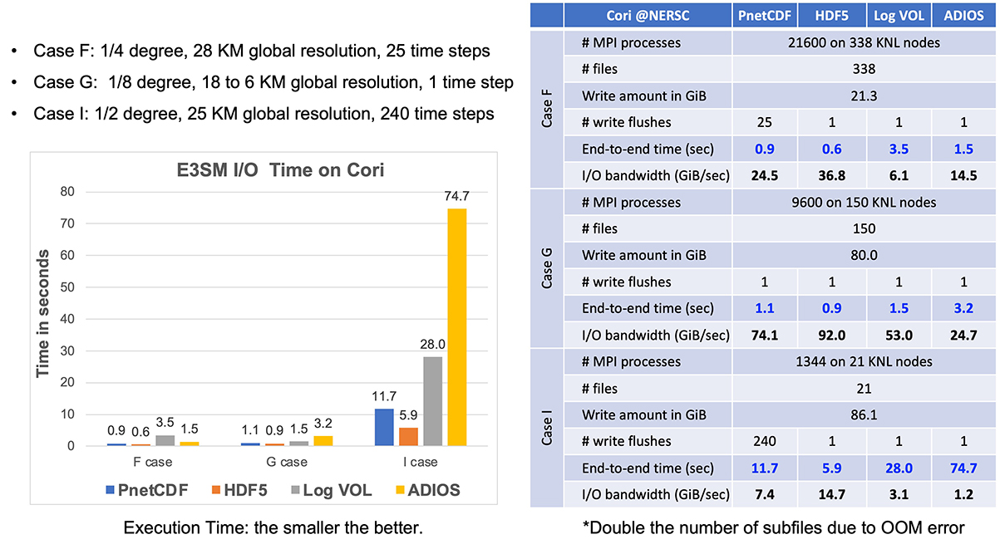
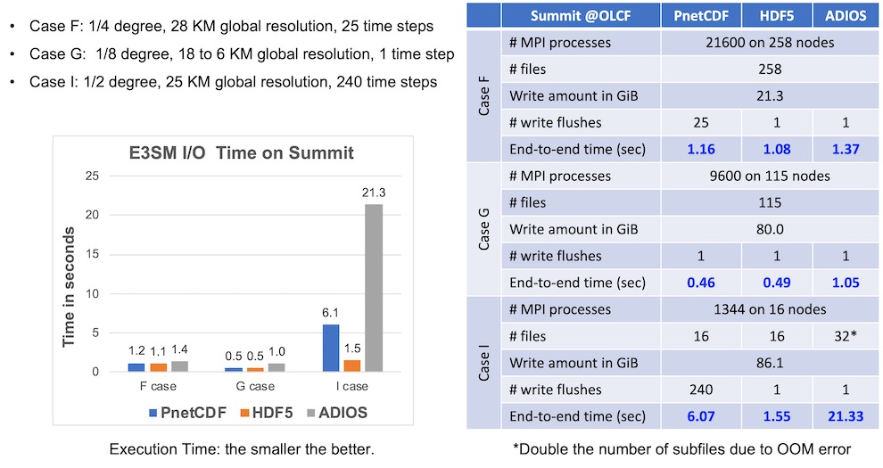

## Parallel I/O Kernel Case Study -- E3SM

This repository contains a case study of parallel I/O kernel from the
[E3SM](https://github.com/E3SM-Project/E3SM) climate simulation model. The E3SM
I/O module, [Scorpio](https://github.com/E3SM-Project/scorpio), can be built on
top of [PnetCDF](https://github.com/Parallel-NetCDF/PnetCDF),
[NetCDF-4](http://www.unidata.ucar.edu/software/netcdf),
[HDF5](https://www.hdfgroup.org/solutions/hdf5), and
[ADIOS](https://github.com/ornladios/ADIOS2).
The benchmark program in this repository is designed to evaluate the E3SM I/O
kernel when using the above mentioned libraries to perform the I/O task. The
challenge of E3SM I/O patterns is that the problem domain is represented by
cubed sphere grids which produce long lists of small and noncontiguous requests
in each of all MPI processes.

The I/O patterns (describing the data decomposition of multi-dimensional arrays
representing the problem domain among MPI processes) used in this case study
were captured by the Scorpio library during the E3SM production runs. A data
decomposition file records the data access patterns at the array element level
by each MPI process. The access offsets are stored in a text file, referred to
as the "decomposition map file". This benchmark currently studies three cases
from E3SM, namely F, G and I cases. Information about the climate variables
written in these three case studies and their decomposition maps can be found
in [variables.md](./variables.md).

[BLOB_IO.md](./BLOB_IO.md) describes the designs of blob I/O methods
implemented in this benchmark.

### Compile and Run Instructions for E3SM-IO
* See [INSTALL.md](./INSTALL.md)
* Current build status:
  

### Performance Results on Cori at NERSC
Below shows the performance in execution times collected in September 2021 for
three blob I/O methods on [Cori](https://docs.nersc.gov/systems/cori/) at
[NERSC](https://www.nersc.gov).

### Performance Results on Summit at OLCF
Below shows the performance in execution times collected in September 2021 for
three blob I/O methods on [Summit at OLCF](https://www.olcf.ornl.gov/summit/).

### Developers
* Wei-keng Liao <<wkliao@northwestern.edu>>
* Kai-yuan Hou <<kai-yuanhou2020@u.northwestern.edu>>

Copyright (C) 2021, Northwestern University.
See [COPYRIGHT](COPYRIGHT) notice in top-level directory.

### Project funding supports:
This research was supported by the Exascale Computing Project (17-SC-20-SC), a
joint project of the U.S. Department of Energy's Office of Science and National
Nuclear Security Administration, responsible for delivering a capable exascale
ecosystem, including software, applications, and hardware technology, to
support the nation's exascale computing imperative.

