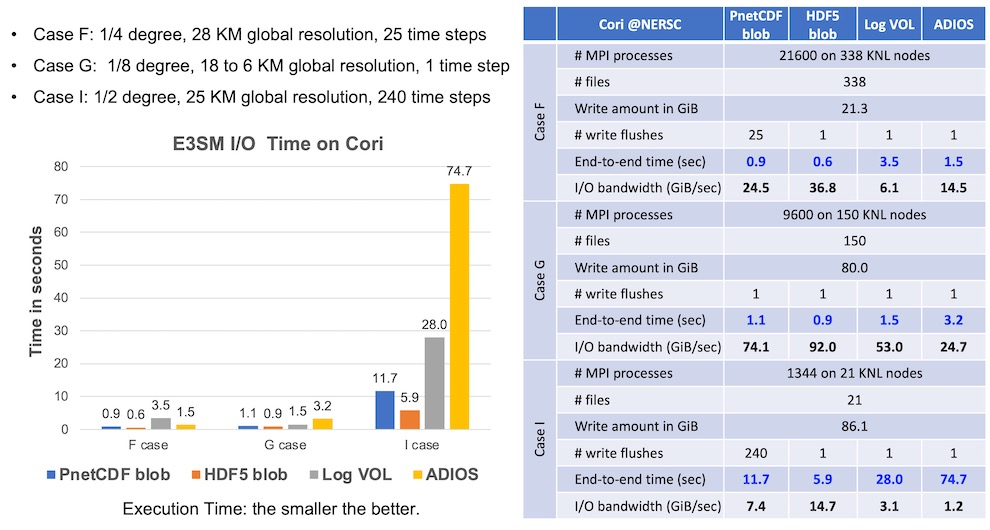
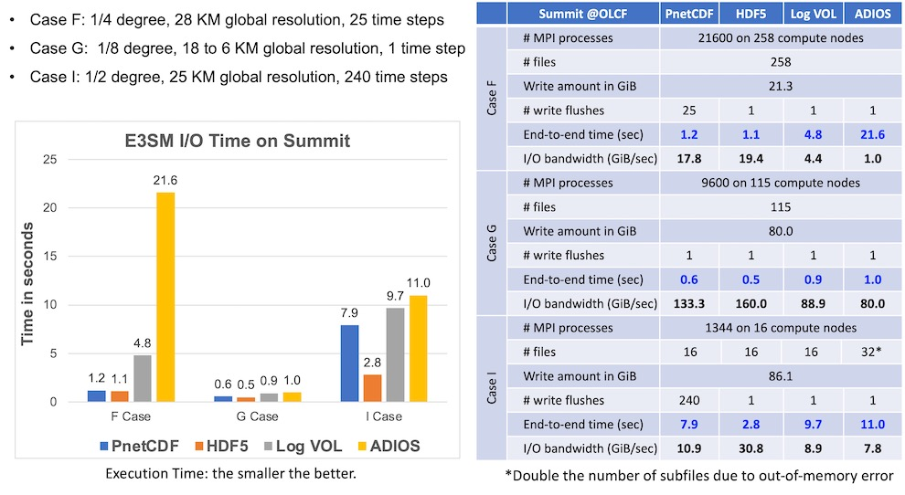

## Parallel I/O Kernel Case Study -- E3SM

This repository contains a case study of parallel I/O kernel from the
[E3SM](https://github.com/E3SM-Project/E3SM) climate simulation model.
E3SM is one of the Department of Energy (DOE) mission applications designed to
run on the DOE leadership parallel computers. The E3SM I/O module,
[Scorpio](https://github.com/E3SM-Project/scorpio), can make use of existing
I/O libraries, such as [PnetCDF](https://github.com/Parallel-NetCDF/PnetCDF),
[NetCDF-4](http://www.unidata.ucar.edu/software/netcdf),
[HDF5](https://www.hdfgroup.org/solutions/hdf5), and
[ADIOS](https://github.com/ornladios/ADIOS2).
The benchmark program in this repository is developed to evaluate the E3SM I/O
kernel performance using the above mentioned libraries.
Achieving a good I/O performance for E3SM on HPC systems is challenging
because its data access pattern consists of a large number of small, unordered,
non-contiguous write requests on each process.

### Data Partitioning Pattern in E3SM
The problem domain in E3SM simulation is represented by a cubed sphere grid
which is partitioned among multiple processes along only X and Y axes that
cover the surface of the problem domain. Domain partitioning among processes
uses the
[Hilbert space curve algorithm](https://en.wikipedia.org/wiki/Hilbert_curve)
to first linearize the 2D cubed sphere grid into subgrids where data points in
a subgrid are physically closer to each other, and then divide the linearized
subgrids evenly among the processes. This partitioning strategy produces in
each process a long list of small, noncontiguous write requests and the file
offsets of any two consecutive requests may not be in an increasing order in
the file space.

The data partitioning patterns (describing the decomposition of the problem
domain represented by multi-dimensional arrays) were captured by the Scorpio
library during the E3SM production runs. There can be multiple decomposition
maps used by different variables. A data decomposition map records the
positions (offsets) of array elements written by each MPI process. The access
offsets are stored in a text file, referred to as the "decomposition map file".

### Three Case Studies
This benchmark currently studies three cases from E3SM, namely F, G and I
cases, simulating the atmospheric, oceanic, and land components, respectively.
Information about the climate variables written in these three case studies and
their decomposition maps can be found in [variables.md](./docs/variables.md).
Table below shows the information about decomposition maps, numbers of
variables, and the maximum and minimum numbers of non-contiguous write requests
among all processes.

|                                        Case |       F |      G |     I |
|:--------------------------------------------|--------:|-------:|-------:|
| Number of MPI processes                     |   21600 |   9600 |   1344 |
| Number of decomposition (partitioning) maps |       3 |      6 |      5 |
| Number of partitioned variables             |     387 |     41 |    546 |
| Number of non-partitioned variables         |      27 |     11 |     14 |
| Total number of variables                   |     414 |     52 |    560 |
| MAX no. noncontig writes among processes    | 184,644 | 21,110 | 41,400 |
| MIN no. noncontig writes among processes    | 174,926 | 18,821 | 33,120 |

### Compile and Run Instructions for E3SM-IO
* See [INSTALL.md](./docs/INSTALL.md). It also describes the command-line run
  options in details.
* Current build/test status:
  
  

### Run Options Include Various I/O Libraries and Two Data Layouts
There are several I/O methods implemented in this case study, including two
data layouts (canonical vs. log) and five parallel I/O libraries of
[PnetCDF](https://github.com/Parallel-NetCDF/PnetCDF),
[NetCDF-4](https://github.com/Unidata/netcdf-c),
[HDF5](https://github.com/HDFGroup/hdf5),
[Log VOL](https://github.com/DataLib-ECP/vol-log-based), and
[ADIOS](https://github.com/ornladios/ADIOS2).
Table below summarizes the supported combinations of libraries and data
layouts. For the full list of I/O options and more detailed descriptions,
readers are referred to [INSTALL.md](./docs/INSTALL.md).

| layout \ library | PnetCDF | HDF5 | Log VOL | ADIOS | NetCDF4 |
|------------------|:-------:|:----:|:-------:|:-----:|:-------:|
| canonical        | yes     | yes  | no      | no    | yes     |
| log (blob)       | yes     | yes  | yes     | yes   | no      |

### Performance Results of Log-layout I/O Methods
For the log layout options available in this benchmark, users are referred to
[BLOB_IO.md](./docs/BLOB_IO.md) for their designs and implementations. Log I/O
methods store write requests by appending the write data one after another,
like a time log, regardless the data's position relative to its global
structure, e.g. a subarray of a multi-dimensional array. Thus data stored in
the file does not follow the dimensional canonical order. On the other hand,
storing data in the canonical order requires an expensive communication to
organize the data among the processes. As the number of processes increases,
the communication cost can become significant. All I/O methods that store data
in the log layout defers the expensive inter-process communication to the data
consumer applications. Usually, "replay" utility programs are made available
for users to convert a file in the log layout to the canonical layout.

* Below shows the execution times of four log-layout based I/O methods
  collected on July 2022 on [Cori](https://docs.nersc.gov/systems/cori/) at
  [NERSC](https://www.nersc.gov).
  

  
  

* Below shows the execution times of four log-layout based I/O methods
  collected in September 2022 on [Summit at OLCF](https://www.olcf.ornl.gov/summit/).
  

  
  

### Developers
* Wei-keng Liao <<wkliao@northwestern.edu>>
* Kai-yuan Hou <<kai-yuanhou2020@u.northwestern.edu>>
* Zanhua Huang <<zanhua@u.northwestern.edu>>

Copyright (C) 2021, Northwestern University.
See [COPYRIGHT](COPYRIGHT) notice in top-level directory.

### Project funding supports:
This research was supported by the Exascale Computing Project (17-SC-20-SC), a
joint project of the U.S. Department of Energy's Office of Science and National
Nuclear Security Administration, responsible for delivering a capable exascale
ecosystem, including software, applications, and hardware technology, to
support the nation's exascale computing imperative.

